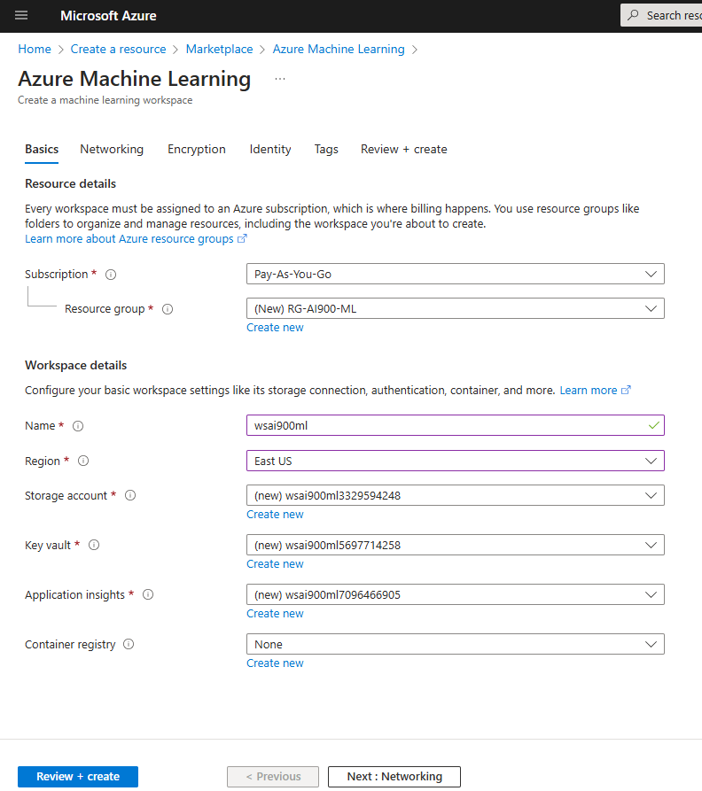
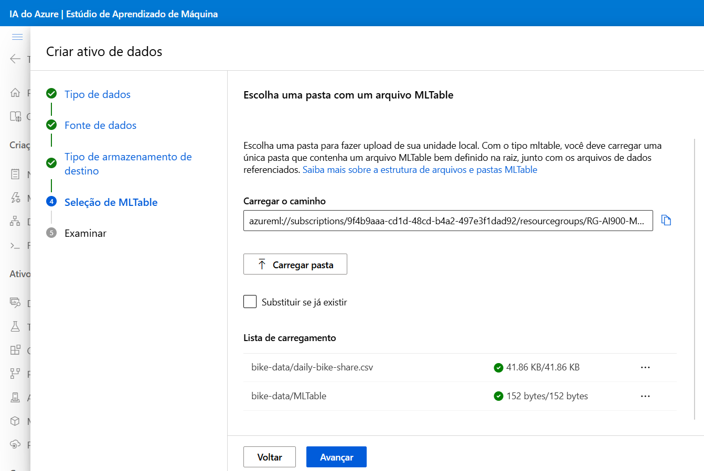
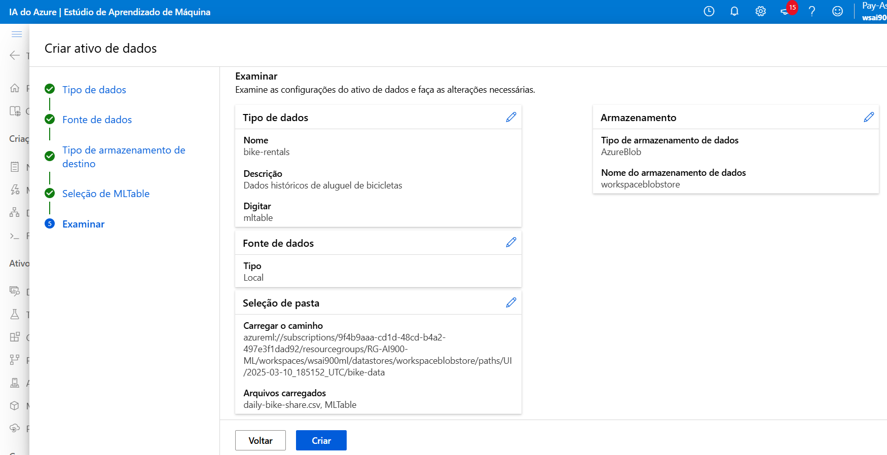

# Explore o Machine Learning automatizado no Azure Machine Learning

Neste laboratório, será usado o recurso de aprendizado de máquina automatizado no Azure Machine Learning para treinar e avaliar um modelo de aprendizado de máquina. Em seguida, será implatado e testado o modelo treinado.

## Criar um workspace do Azure Machine Learning

Para usar o Azure Machine Learning, você precisa provisionar um workspace do Azure Machine Learning em sua assinatura do Azure. Em seguida, você poderá usar o Azure Machine Learning Studio para trabalhar com os recursos em seu workspace.

> Dica: Se você já possui um workspace do Azure Machine Learning, pode usá-lo e pular para a próxima tarefa.

1. Faça login no [portal do Azure](https://portal.azure.com) usando suas credenciais da Microsoft.
2. Selecione **+ Criar um recurso**, procure por **Machine Learning** e crie um novo recurso de Machine Learning do Azure com as seguintes configurações:



   - **Assinatura**: Sua assinatura do Azure.
   - **Grupo de recursos**: Crie ou selecione um grupo de recursos.
   - **Nome**: Insira um nome exclusivo para seu workspace.
   - **Região**: Leste dos EUA.
   - **Conta de armazenamento**: Observe a nova conta de armazenamento padrão que será criada para seu workspace.
   - **Key vault**: Observe o novo cofre de chaves padrão que será criado para seu workspace.
   - **Application insights**: Observe o novo recurso de insights de aplicativo padrão que será criado para seu workspace.
   - **Registro de contêiner**: Nenhum (um será criado automaticamente na primeira vez que você implantar um modelo em um contêiner).
3. Selecione **Revisar + criar** e, em seguida, **Criar**. Aguarde a criação do seu workspace (isso pode levar alguns minutos) e, em seguida, vá para o recurso implantado.

### Iniciar o Studio

1. No recurso do seu workspace do Azure Machine Learning, selecione **Iniciar o Studio** (ou abra uma nova aba do navegador e navegue para [https://ml.azure.com](https://ml.azure.com)) e faça login no Azure Machine Learning Studio usando sua conta da Microsoft. Feche quaisquer mensagens que forem exibidas.


2. No Azure Machine Learning Studio, você deve ver seu workspace recém-criado. Se não, selecione **Todos os workspaces** no menu à esquerda e, em seguida, selecione o workspace que você acabou de criar.


## Usar o aprendizado de máquina automatizado para treinar um modelo

O aprendizado de máquina automatizado permite que você experimente múltiplos algoritmos e parâmetros para treinar diversos modelos e identificar o melhor para seus dados. Neste exercício, você usará um conjunto de dados históricos de detalhes de aluguel de bicicletas para treinar um modelo que prevê o número de aluguéis de bicicletas esperados em um determinado dia, com base em características sazonais e meteorológicas.

> Citação: Os dados usados neste exercício são derivados do [Capital Bikeshare](https://www.capitalbikeshare.com) e são utilizados de acordo com o [acordo de licença](https://www.capitalbikeshare.com).

1. No [Azure Machine Learning Studio](https://ml.azure.com), acesse a página **Automated ML** no menu à esquerda.


2. Crie um novo trabalho de aprendizado de máquina automatizado com as seguintes configurações, usando **Avançar** conforme necessário para avançar na interface do usuário:
   **Configurações básicas:**
   - **Nome do trabalho**: O campo de nome do trabalho já deve estar preenchido com um nome exclusivo. Mantenha-o como está.
   - **Nome do novo experimento**: `mslearn-bike-rental`
   - **Descrição**: Aprendizado de máquina automatizado para previsão de aluguel de bicicletas
   - **Tags**: nenhuma

   

   **Tipo de tarefa e dados:**
   - **Selecionar tipo de tarefa**: Regressão
   - **Selecionar conjunto de dados**: Crie um novo conjunto de dados com as seguintes configurações:
     - **Tipo de dados:**

     

       - **Nome**: `bike-rentals`
       - **Descrição**: `Dados históricos de aluguel de bicicletas`
       - **Tipo**: Tabela (mltable)
     - **Fonte de dados:**
       - Selecione **A partir de arquivos locais**
     - **Tipo de armazenamento de destino:**

     

       - **Tipo de armazenamento**: Armazenamento de Blobs do Azure
       - **Nome**: `workspaceblobstore`
       - **Seleção de MLtable:**

        

       - **Pasta de upload**: Baixe e descompacte a pasta que contém os dois arquivos que você precisa fazer upload [https://aka.ms/bike-rentals](https://aka.ms/bike-rentals)

       

   **Configurações da tarefa:**
   - **Tipo de tarefa**: Regressão
   - **Conjunto de dados**: `bike-rentals`
   - **Coluna alvo**: `rentals` (inteiro)
   - **Configurações adicionais:**
     - **Métrica principal**: `NormalizedRootMeanSquaredError`
     - **Explique o melhor modelo**: `Não selecionado`
     - **Habilitar empilhamento de conjunto**: `Não selecionado`
     - **Usar todos os modelos suportados**: `Não selecionado`. Você restringirá o trabalho para tentar apenas alguns algoritmos específicos.
    - **Modelos permitidos**: Selecione apenas **RandomForest** e **LightGBM** — normalmente você tentaria o máximo possível, mas cada modelo adicionado aumenta o tempo necessário para executar o trabalho.
   - **Limites****: Expandir seção.
    - **Máximo de avaliações**: `3`
    - **Máximo de avaliações simultâneas**: `3`
    - **Máximo de nós**: `3`
    - **Limite de pontuação métrica**: `0.085` ( para que se um modelo atingir uma pontuação métrica de erro quadrático médio normalizado de 0,085 ou menos, o trabalho termine. )
    - **Tempo limite do experimento (minutos)**: `15`
    - **Tempo limite de iteração (minutos)**: `15`
    - **Habilitar encerramento antecipado**: `Selecionado`
   - **Validar e testar**:
    - **Tipo de validação**: `Divisão de validação de treinamento`
    - **Validação de percentual de dados**: `10`
    - **Dados de teste**: `Nenhum`

    

- **Computação**:

 - **Selecione o tipo de computação**: `Sem servidor`
 - **Tipo de máquina virtual**: `CPU`
 - **Camada de máquina virtual**: `Dedicada`
 - **Tamanho da máquina virtual**: `Standard_DS3_V2*`
 - **Número de instâncias**: `1`

- * Se sua assinatura restringir os tamanhos de VM disponíveis para você, escolha qualquer tamanho disponível.

3. Envie o trabalho de treinamento. Ele inicia automaticamente.

4. Espere o trabalho terminar. Pode levar um tempo.

## Implantar o modelo treinado

1. Após a conclusão do treinamento, selecione o melhor modelo encontrado.


2. Na guia **Modelo** para o melhor modelo treinado pelo seu trabalho de aprendizado de máquina automatizado, selecione Implantar e use a opção Ponto de extremidade em tempo real para implantar o modelo com as seguintes configurações:
**Máquina virtual**: `Standard_DS3_v2`
**Contagem de instâncias**: `3`
**Ponto final**: Novo
**Nome do ponto de extremidade**: `deixe o padrão ou certifique-se de que seja globalmente exclusivo`
Nome da implantação : `Deixe o padrão`
Inferência de coleta de dados : `Desativado`
Modelo de pacote : `Desativado`
- * Observação: se você receber uma mensagem de que não há cota suficiente para selecionar a máquina virtual Standard_DS3_v2 , selecione uma diferente.


3. Aguarde o início da implantação - isso pode levar alguns segundos. O status de Implantação para o endpoint predict-rentals será indicado na parte principal da página como Running.

4. Aguarde até que o **status Deploy** mude para Succeeded. Isso pode levar de 5 a 10 minutos.

## Testar o modelo implantado

1. No Azure Machine Learning Studio, no menu à esquerda, selecione **Endpoints** e abra o endpoint em tempo real **predict-rentals**.

2. Na página do endpoint em tempo real do **predict-rentals**, visualize a guia Teste .

3. No painel **Dados de entrada para testar o ponto de extremidade**, substitua o JSON do modelo pelos seguintes dados de entrada:
```JSON
   {
  "input_data": {
    "columns": [
      "day",
      "mnth",
      "year",
      "season",
      "holiday",
      "weekday",
      "workingday",
      "weathersit",
      "temp",
      "atemp",
      "hum",
      "windspeed"
    ],
    "index": [0],
    "data": [[1,1,2022,2,0,1,1,2,0.3,0.3,0.3,0.3]]
  }
 }
```
4. Clique no botão Testar .

5. Revise os resultados do teste, que incluem um número previsto de aluguéis com base nos recursos de entrada - semelhante a este:
```JSON
 [
   352.3564674945718
 ]
 ```